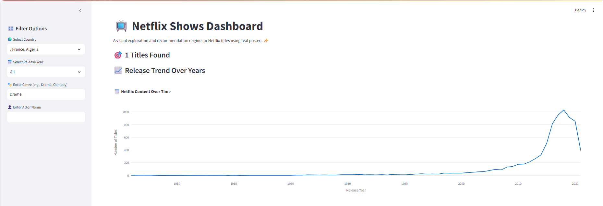
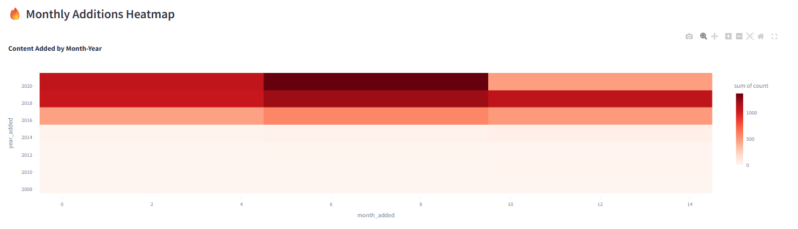
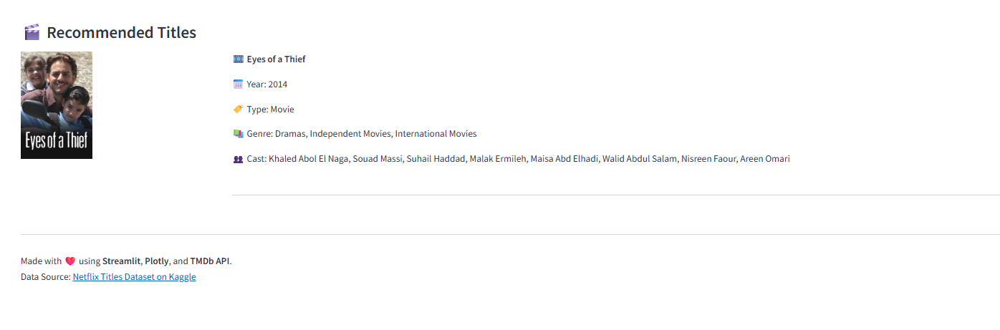

## Netflix Shows EDA and Streamlit Dashboard

This project presents an Exploratory Data Analysis (EDA) and a fully functional Streamlit Dashboard based on the Netflix Shows Dataset. The aim is to visualize patterns in Netflix content, perform data cleaning, generate insights, and build an interactive dashboard with TMDb poster support.

## Project Features

- EDA Notebook with data cleaning, missing value handling, visualizations, and trend analysis.
- Prediction Model: Used Linear Regression to predict the number of Netflix content releases for 2025.
- Interactive Streamlit Dashboard: Filter Netflix titles by country, year, genre, and actor.
- Poster Fetching: Integrated TMDb API to fetch real movie/show posters dynamically.
- Visuals include line plots, bar charts, heatmaps, and recommendations.

## Technologies Used

- Python 3
- Pandas, NumPy for data manipulation
- Matplotlib, Seaborn, Plotly for visualization
- Streamlit for web dashboard
- scikit-learn for prediction model
- TMDb API and Requests for poster fetching

## Project Structure
```
├── netflix_titles.csv # Dataset
├── Netflix_EDA.ipynb # Jupyter Notebook with EDA and Predictions
├── app.py # Streamlit App (Dashboard + TMDb Integration)
├── requirements.txt # Python dependencies
├── README.md # Project description
└── images/ # Dashboard and EDA Screenshots
```
## How to Run the Streamlit App

1. Install required libraries:

```bash
pip install -r requirements.txt
```
2. Run the dashboard:

```bash
streamlit run app.py
```

## Dataset Source

https://www.kaggle.com/datasets/shivamb/netflix-shows

## Future Scope

- Integration with IMDb ratings and reviews for deeper analysis.

- Sentiment analysis based on user reviews.

- Advanced recommendation systems using collaborative filtering.

- Comparative analysis with other streaming platforms.

## Conclusion

- Netflix has more movies than TV shows.

- Content is majorly produced in the United States.

- Post-2015 saw a huge spike in new additions.

- Prediction indicates continuous content addition trend in 2025.

## Acknowledgements

- Kaggle Netflix Dataset
- TMDb API for movie posters
- Streamlit and Plotly libraries

## Sample Dashboard Screenshots

### Streamlit Dashboard Home


### Top 10 Genres


### Monthly Additions Heatmap


### Recommendations Section


